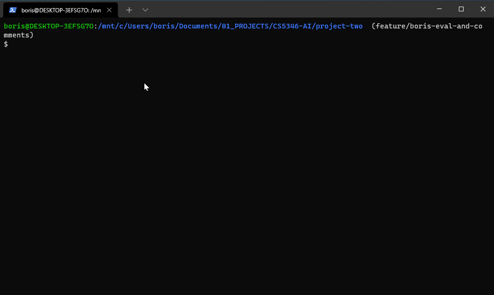
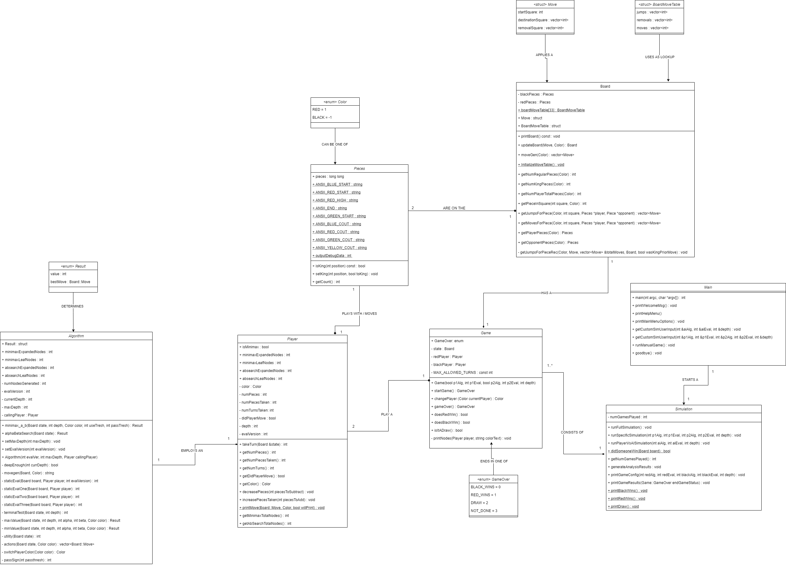
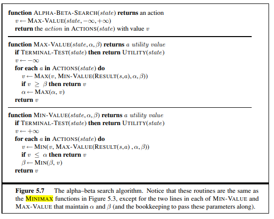

# AI Checkers Engine
A two player game for CS5346 Artificial Intelligence

This program implements the mini-max-a-b search and alpha-beta-prune search algorithms. 

## How to Build and Run the Application

This application is primarily designed to run on Linux. 
It may be ran on the Texas State (TXST) Linux servers.
Eros: EROS.CS.TXSTATE.EDU (147.26.231.153)
Zeus: ZEUS.CS.TXSTATE.EDU (147.26.231.156)

1. Build with this command:    
    `g++ -o Project2 Project2-A04626934.cpp -std=c++11`
2. Run with this command:    
    `./CheckersAI`
3. To see help menu (optional):    
    `./CheckersAI -h`
4. To run with no color:     
    `./CheckersAI -nc`
5. To run with no debug output:    
    `./CheckersAI -no`
6. To run with no debug output and no color:    
    `./CheckersAI -ncno`
7. To put std output in a log file:     
    `./CheckersAI -nc | tee myFile.log`

## Project Report

A very detailed project report is available under:    
`docs/Project2-Report.pdf`

This report covers everything about the program exhaustively - how to build and run it, analysis of results, a complete breakdown of each class and method implementations, and much more. 

## Program Demo

## Class Diagram 

## Alpha-Beta Search Algorithm

### Notes 
It is recommended to have the the PuTTY terminal maximized to fill the screen. Use option 2 from the main menu to run a game with one configuration at a time. 
If outputting to a log file using #8 above, color should be disabled using -nc to prevent ANSII characters from printing. 
The project report along with all results and output are provided in the same ZIP containing this README file. 

### References

1. Why use enum class and not plain enum?     
https://stackoverflow.com/questions/18335861/why-is-enum-class-preferred-over-plain-enum
